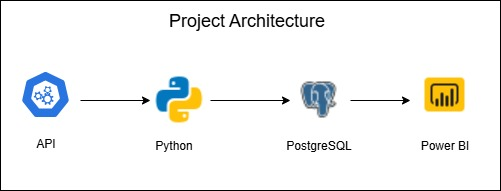

# Building an Efficient ETL Pipeline for Property Records in Real Estate using PostgresSQL Database for Zipco Real Estate Agency

## Business Introduction
Zipco Real Estate Agency operates in the fast-paced and competitive world of real estate, where timely access to accurate information is crucial for success. Our success factors likely include a strong understanding of local market dynamics, effective marketing strategies, and a commitment to client relationships. Our business focus may center on providing exceptional customer service, leveraging technology for efficient operations, and maintaining a robust online presence to attract leads.

However, the company is currently facing a significant data challenge that hinders its operational efficiency. The existing data processing workflow is inefficient, resulting in disparate datasets.

## Business Problem

#### Inefficient Data Processing Workflow:
The current data processing system is cumbersome and inefficient, leading to delays in accessing critical property information.
#### Disparate Datasets and Inconsistent Formats:
This disorganisation complicates data analysis and reporting, making it challenging for agents to derive actionable insights and for management to make informed strategic decisions.
#### Increased Operational Costs:
Time spent on manual data entry, reconciliation, and error correction diverts resources away from more productive activities, ultimately impacting the agency's bottom line.
#### Compromised Data Quality:
The lack of a streamlined data management process lead to compromised data quality, including inaccuracies and outdated information.

## Rationale for the Project

Implementing a comprehensive ETL (Extract, Transform, Load) pipeline at Zipco Real Estate Agency is multifaceted, addressing the core challenges the company faces while also aligning with its strategic goals, and the desire to overcome existing data challenges, enhance operational efficiency, and position the company for sustainable growth and success in a competitive landscape.

1. Enhanced Operational Efficiency: By automating and streamlining data processing workflows, the ETL pipeline will significantly reduce the time and effort required to gather, clean, and prepare data.
2. Improved Data Quality and Consistency: The ETL process will standardize data formats and ensure that information from various
sources is accurately integrated. This consistency enhances data quality, enabling agents and management to make informed decisions based on reliable and up-to-date information.
3. Timely Access to Critical Information: With a well-structured ETL pipeline, Zipco will be able to access critical property information and market insights in real-time. This timely access is essential for making quick decisions in a fast-paced real estate environment, ultimately leading to better service for clients and increased sales opportunities.
4. Cost Reduction: By minimizing manual data handling and reducing errors, the ETL pipeline can lead to significant cost savings. Lower operational costs can be redirected towards growth initiatives, marketing efforts, or enhancing customer service, thereby improving overall profitability.
5. Competitive Advantage: In the competitive real estate market, having access to high-quality, timely data can set Zipco apart from its competitors. By leveraging advanced data management capabilities, the agency can offer superior insights to clients, enhance marketing strategies, and respond more effectively to market trends.
6. Enhanced Decision-Making: With improved data quality and accessibility, management will be better equipped to make strategic
decisions based on accurate insights and analytics. This informed decision-making can drive the agency's growth and help it navigate the complexities of the real estate market more effectively.

## Aim of Project
1. Automation: Create an automated ETL pipeline that can be scheduled to run at defined intervals. Implement logging and monitoring to track pipeline performance and identify potential issues.
2. Data Cleaning and Transformation: Implement robust data cleaning and transformation procedures to ensure data accuracy and consistency.
3. Data Extraction: Implement a Python-based solution to fetch property records from the Real Estate API.
4. Database Loading: Design an optimized loading process to efficiently insert transformed data into the PostgresSQL database.

## Project Architecture

## Tech Stack

1. Python: For scripting data extraction, cleaning, and transformation processes.
2. SQL: For database design, schema creation, and data transformation logic.
3. PostgresSQL: a Relational database to store and manage data files during the ETL process.
4. GitHub: Manages version control and collaboration for code, documentation, and project tracking.
5. Draw.io: Utilized to create diagrams that outline data flow, architecture, and ETL process design.
6. Power BI: Visualizes data insights and trends, providing dashboards and analytics for stakeholders.
